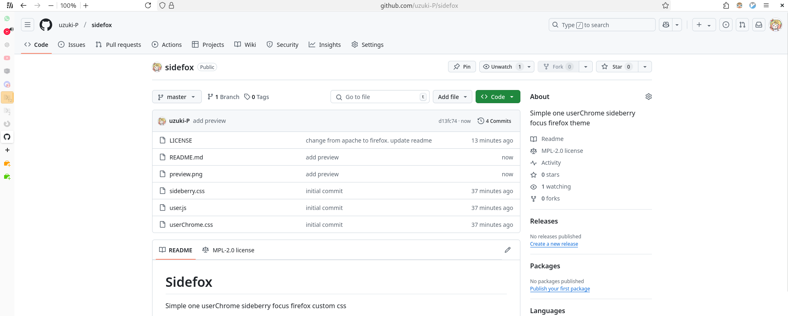

# Sidefox

Simple one userChrome sideberry focus firefox custom css

This is just a simple firefox which hide the main tab bar and hoverable
sideberry & sidebar.

Code mostly taken from [ShyFox](https://github.com/Naezr/ShyFox) for the sweet colored
address bar and [DownTownUI](https://github.com/oviung/DownToneUI-Firefox) for
the simple hoverable sideberry & sidebar.

Preview:

